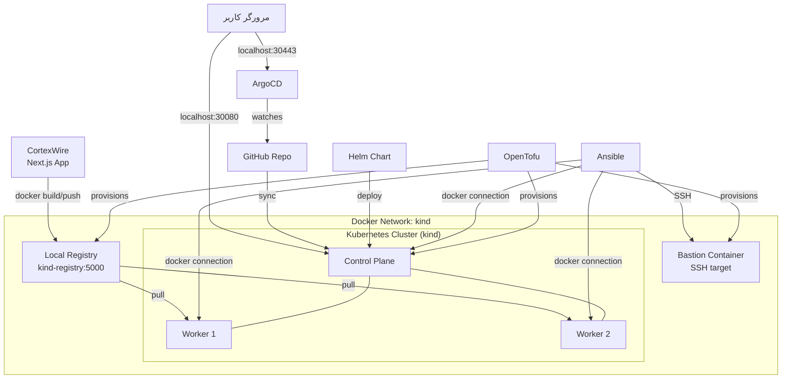

# Mini-Cloud Platform — Case Study

یه پلتفرم کامل و محلی که معماری واقعی صنعتی (Terraform + Ansible + Kubernetes + Helm + ArgoCD) رو بدون هیچ هزینه‌ی cloud شبیه‌سازی می‌کنه — ساخته‌شده روی WSL2 (Windows)، در شرایط محدودیت شبکه واقعی (تحریم).

## معماری کلی



## پشته تکنولوژی و نقش هرکدام

| ابزار | نسخه | نقش |
|---|---|---|
| OpenTofu | 1.12.6 | ساخت شبکه، رجیستری، بستیون، و کلاستر kind با کد |
| kind | v0.32.0 | اجرای کلاستر واقعی Kubernetes داخل کانتینرهای Docker |
| Ansible | core 2.20.1 | پیکربندی بستیون (SSH) و نودهای kind (Docker connection) |
| Docker | 29.1.3 | موتور اصلی زیرساخت (WSL2 native، نه Docker Desktop) |
| Next.js | 15.5.22 | اپلیکیشن دیپلوی‌شده (CortexWire) |
| Helm | v3.21.4 | بسته‌بندی و دیپلوی اپلیکیشن روی کلاستر |
| ArgoCD | v3.5.3 | GitOps — سینک خودکار از GitHub به کلاستر |

## سفر ساخت — به ترتیب مراحل

1. **آماده‌سازی ابزارها** روی WSL2 Ubuntu (نصب Docker، OpenTofu، Ansible، kubectl، Helm، kind، ArgoCD CLI)
2. **ساختار پروژه** — ریپوی Git با پوشه‌بندی `terraform/`, `ansible/`, `helm-chart/`, `app/`, `docs/`
3. **Terraform: زیرساخت پایه** — شبکه Docker، رجیستری خصوصی، کلاستر kind سه‌نودی با provisioner `local-exec`
4. **Ansible: پیکربندی سرورها** — یک بستیون SSH-based + پیکربندی مستقیم نودهای kind با Docker connection plugin
5. **Build & Push** — Dockerize کردن CortexWire (Next.js) با multi-stage build و push به رجیستری محلی
6. **Helm Chart و Deploy** — نوشتن Chart سفارشی (Deployment + Service + probes) و دیپلوی روی کلاستر
7. **GitOps با ArgoCD** — نصب ArgoCD و اتصال به GitHub برای sync خودکار
8. **تست Chaos و مستندسازی** — بررسی رفتار خودترمیمی کلاستر در برابر خرابی واقعی نود

## چالش‌ها و راه‌حل‌ها

بخش مهم‌ترین این پروژه: هر مانعی که رد شد، یه درس واقعی DevOps بود.

### ۱. تحریم Docker Hub
**مشکل:** هر `docker pull` از `registry-1.docker.io` با خطای `403 Forbidden` مواجه می‌شد.
**راه‌حل:** تنظیم `registry-mirrors` در `/etc/docker/daemon.json` روی `mirror.cdn.ir` (mirror ایرانی)، مستقیم روی daemon بومی Docker در WSL2 (نه Docker Desktop، چون WSL از یک daemon جدا استفاده می‌کرد).
**درس:** همیشه از `docker context ls` مطمئن شو داری با کدام daemon حرف می‌زنی.

### ۲. تحریم دانلود مستقیم Terraform/kind
**مشکل:** `releases.hashicorp.com` و redirect سرویس دانلود kind هر دو بلاک بودن.
**راه‌حل:** استفاده از **OpenTofu** (فورک متن‌باز Terraform، بدون محدودیت) و دانلود مستقیم از GitHub releases به‌جای واسط‌ها.

### ۳. تحریم quay.io (برای ایمیج‌های ArgoCD)
**مشکل:** همه پادهای ArgoCD با `403 Forbidden` از `quay.io` گیر کردن.
**راه‌حل:** تعریف یک `registry mirror` اختصاصی برای `quay.io` (`quay-mirror.liara.ir`) مستقیم در `containerdConfigPatches` کانفیگ kind — نه در سطح Docker daemon، بلکه در سطح containerd داخل نودهای کلاستر.
**درس:** هر رجیستری ممکن است mirror جداگانه نیاز داشته باشد؛ راه‌حل باید در همان لایه‌ای اعمال شود که مشکل رخ می‌دهد (Docker daemon برای WSL، containerd برای نودهای kind).

### ۴. HTTP در برابر HTTPS برای رجیستری محلی
**مشکل:** نودهای kind سعی می‌کردند با HTTPS به رجیستری محلی (`kind-registry:5000`) که فقط HTTP داشت وصل شوند.
**راه‌حل:** تعریف صریح `insecure_skip_verify = true` برای این رجیستری در تنظیمات containerd.

### ۵. عدم انتشار NodePort به هاست
**مشکل:** سرویس‌های NodePort (پورت ۳۰۰۸۰ برای اپ، ۳۰۴۴۳ برای ArgoCD) از داخل Docker در دسترس بودند ولی از `localhost` سیستم نه.
**راه‌حل:** اضافه‌کردن `extraPortMappings` صریح در کانفیگ kind برای هر پورت NodePort مورد نیاز.
**درس:** kind فقط پورت‌هایی را که صراحتاً در `extraPortMappings` تعریف شوند به هاست منتشر می‌کند.

### ۶. تداخل مالکیت منابع (Helm دستی در برابر ArgoCD)
**مشکل:** نصب دستی با `helm install` و سپس تعریف همان اپلیکیشن در ArgoCD باعث تداخل NodePort و خطای Sync شد.
**راه‌حل:** `helm uninstall` دستی قبل از واگذاری کنترل کامل به ArgoCD.
**درس:** در GitOps واقعی، فقط یک ابزار باید مالک یک منبع باشد — یا Helm دستی، یا ArgoCD، هرگز هر دو همزمان.

### ۷. تنظیمات دستی که با rebuild از بین می‌رفتند
**مشکل:** `kubectl patch` روی NodePort سرویس ArgoCD با هر rebuild کلاستر از بین می‌رفت، چون بخشی از IaC نبود.
**درس:** هر تغییری که باید ماندگار باشد باید در کد (Terraform/Helm)، نه در دستورات دستی، تعریف شود.

### ۸. Chaos خودجوش و واقعی
**رخداد:** در حین توسعه، کانتینر `mini-cloud-worker` به‌طور غیرمنتظره با کد خروج ۱۳۷ (SIGKILL) متوقف شد — به احتمال زیاد به‌دلیل فشار حافظه روی WSL2 (بیش از ۹۵٪ RAM در حال استفاده بود، با کلاستر kind + ArgoCD + آزمایشگاه مانیتورینگ به‌طور همزمان فعال).
**رفتار مشاهده‌شده:** Kubernetes بدون هیچ دخالت انسانی، پادهای روی نود از دست‌رفته را روی نود سالم (`mini-cloud-worker2`) بازتوزیع کرد.
**ریکاوری:** با `docker start mini-cloud-worker`، نود ظرف چند ثانیه دوباره به کلاستر پیوست و وضعیت `Ready` گرفت.
**درس:** خودترمیمی Kubernetes یک ویژگی نظری نیست — حتی در برابر خرابی واقعی (نه شبیه‌سازی‌شده) هم کار می‌کند.

## تست GitOps end-to-end

برای اثبات حلقه کامل GitOps، مقدار `replicaCount` در `values.yaml` از ۲ به ۳ تغییر کرد و مستقیم به GitHub push شد — بدون هیچ دستور دستی به کلاستر. ArgoCD ظرف چند ثانیه این تغییر را شناسایی و اعمال کرد و پاد سوم به‌طور خودکار ساخته شد.

## چگونه اجرا کنیم (Reproduce)

```bash
# ۱. زیرساخت
cd terraform && tofu init && tofu apply

# ۲. پیکربندی
cd ../ansible
ansible-playbook playbooks/configure-bastion.yml
ansible-playbook playbooks/configure-kind-nodes.yml

# ۳. Build و Push اپلیکیشن
cd ../app
docker build -t localhost:5001/cortexwire:v1 .
docker push localhost:5001/cortexwire:v1

# ۴. Deploy اولیه (یا مستقیم از طریق ArgoCD)
cd ../helm-chart
helm install cortexwire ./cortexwire --kube-context kind-mini-cloud

# ۵. GitOps
kubectl create namespace argocd
kubectl apply -n argocd -f https://raw.githubusercontent.com/argoproj/argo-cd/stable/manifests/install.yaml
argocd app create cortexwire-gitops \
  --repo <repo-url> --path helm-chart/cortexwire \
  --dest-server https://kubernetes.default.svc --dest-namespace default \
  --sync-policy automated --self-heal --auto-prune
```

## محدودیت‌های شناخته‌شده (برای صداقت فنی)

- `host_key_checking` در Ansible برای محیط لوکال غیرفعال است — در production باید فعال باشد
- رمز SSH بستیون به‌صورت ساده (`devops:devops`) است — فقط برای محیط لوکال، هرگز در production
- گواهی TLS ArgoCD خودامضا است (`--insecure` در CLI) — برای production نیاز به گواهی معتبر دارد
- منابع محدود WSL2 (RAM) باعث یک خرابی واقعی در حین توسعه شد؛ در محیط production با منابع کافی این ریسک کمتر است اما همچنان باید با resource limits و monitoring مدیریت شود
